<!-- Social badges section -->
<!-- Badges with custom icons - https://github.com/DenverCoder1/custom-icon-badges -->
<!-- View counter - https://github.com/DenverCoder1/Simple-View-Counter -->

  
  
  

 

## ⚡ Technologies

## EasyA Course Completion Certifications

<strong>Solana</strong>

<table>
  <tr>
    <td>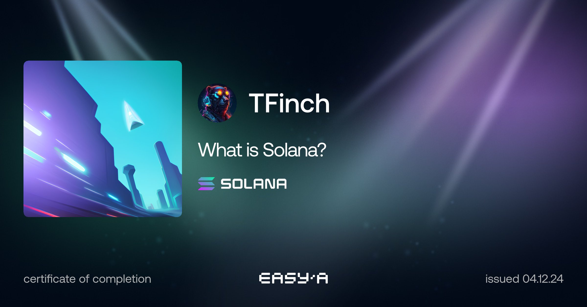</td>
    <td>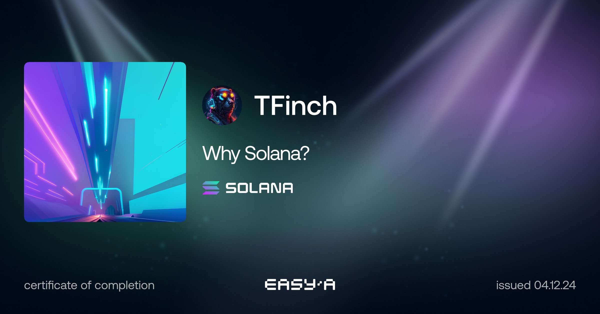</td>
    <td>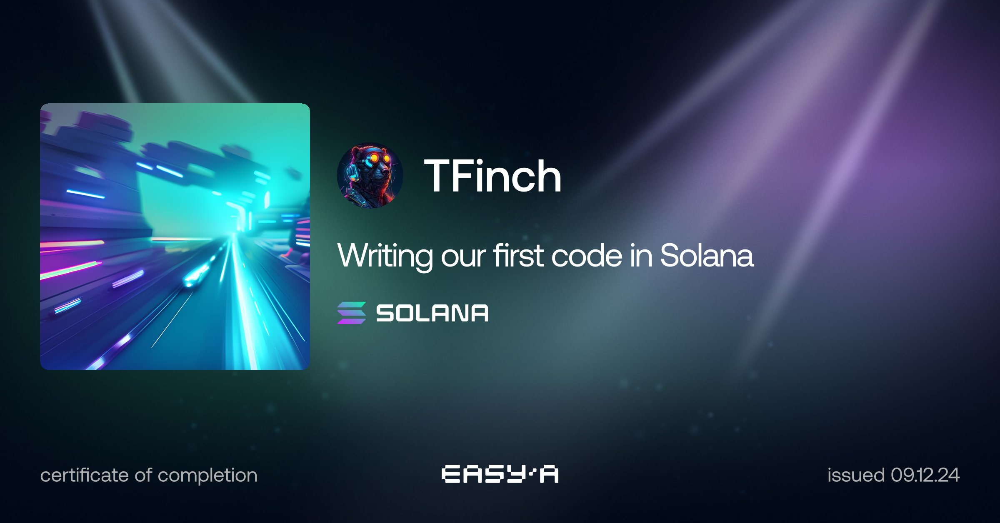</td>
    <td>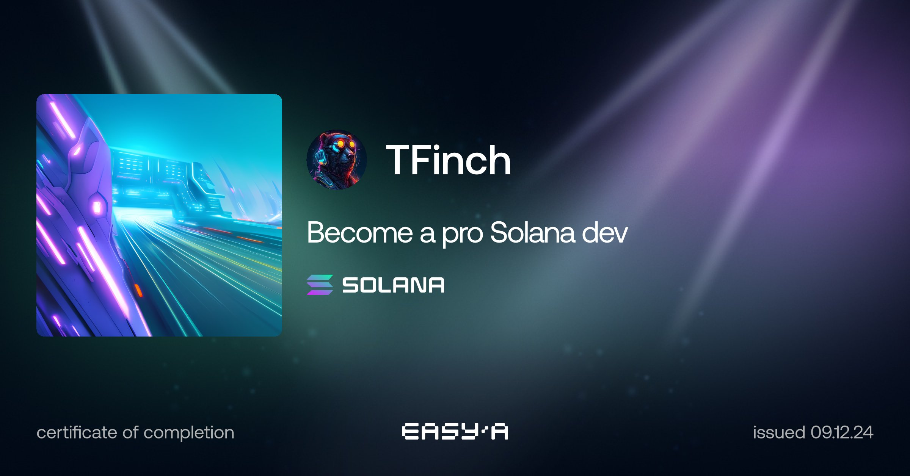</td>
  </tr>
</table>

<strong>XRP</strong>

<table>
  <tr>
    <td>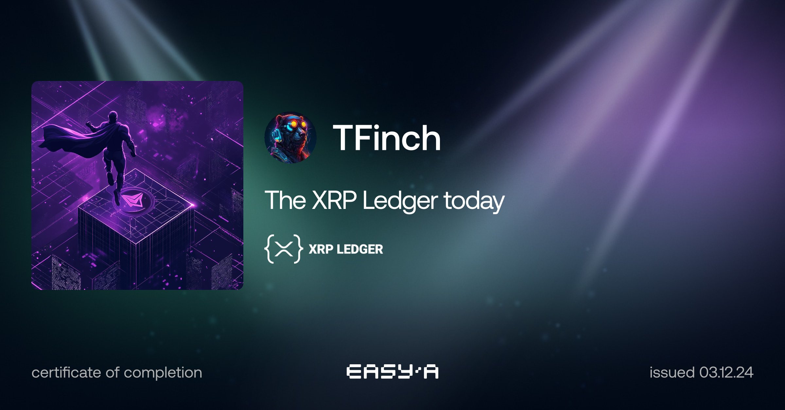</td>
    <td>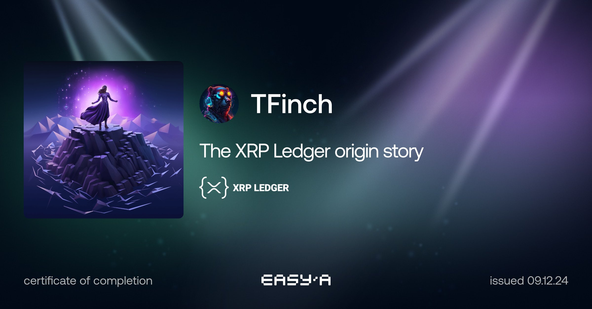</td>
    <td>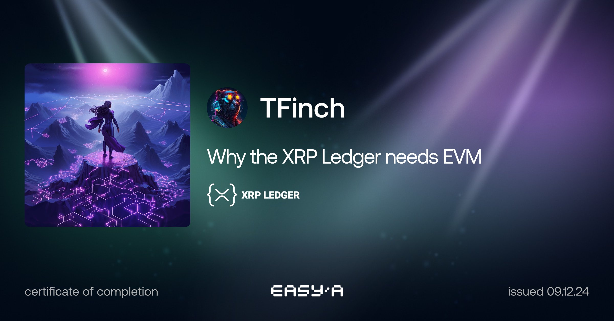</td>
  </tr>
  <tr>
    <td>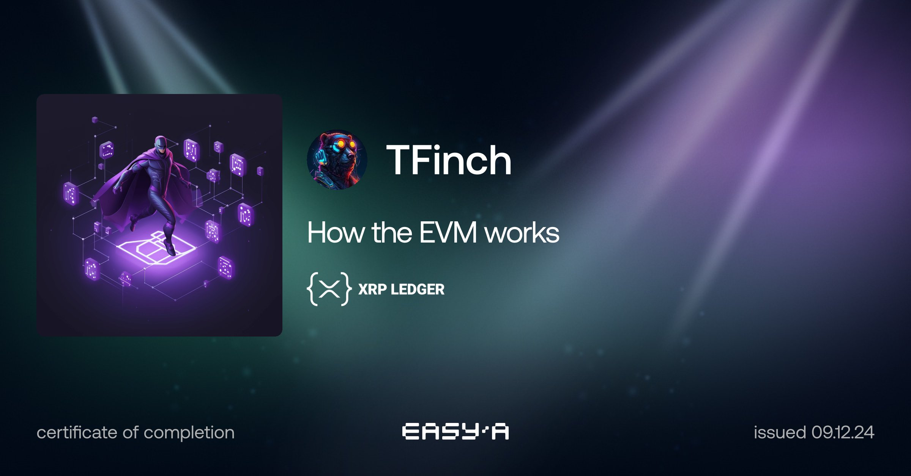</td>
    <td>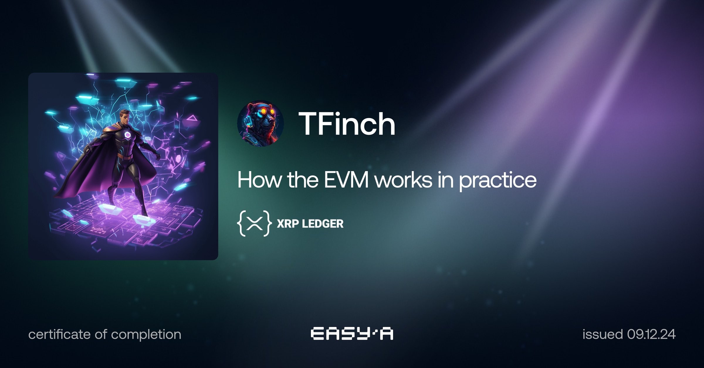</td>
    <td>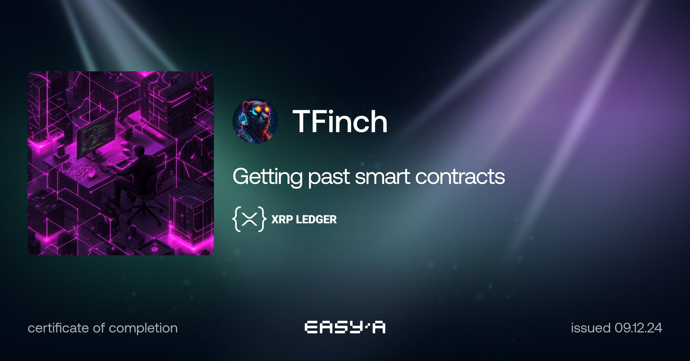</td>
  </tr>
  <tr>
    <td>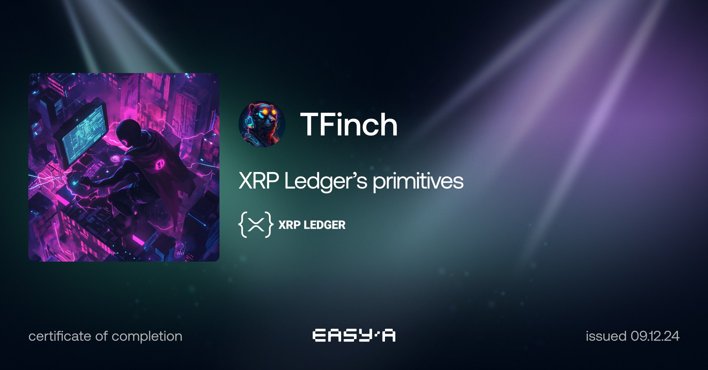</td>
    <td>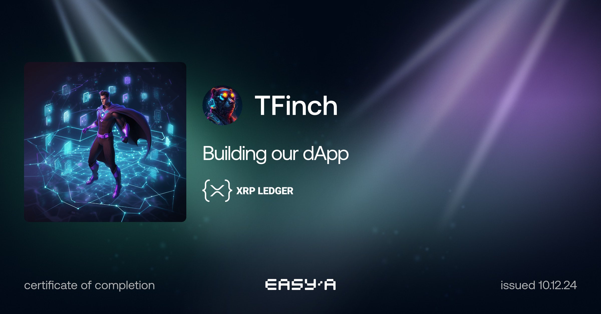</td>
    <td>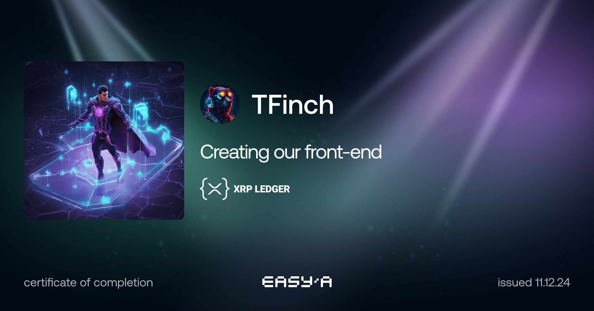</td>
  </tr>
  <tr>
    <td>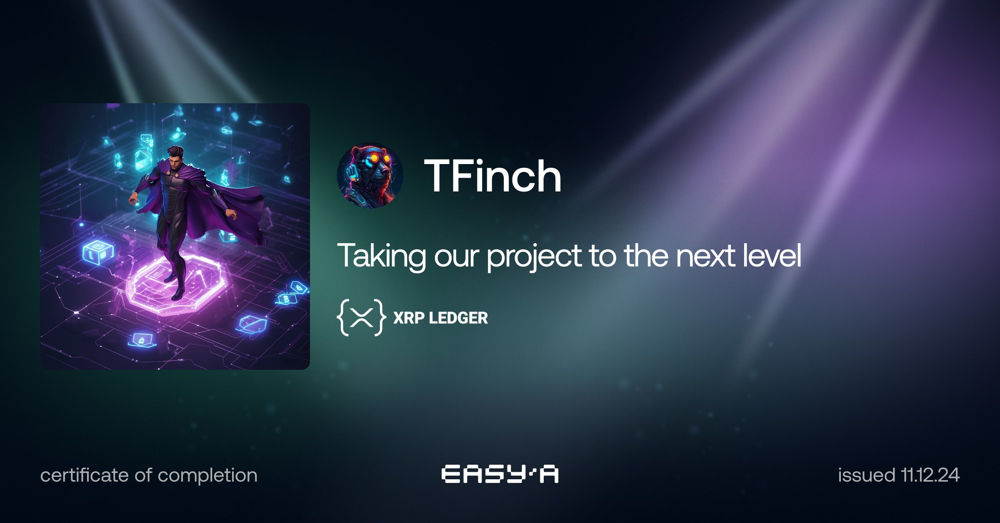</td>
  </tr>
</table>

